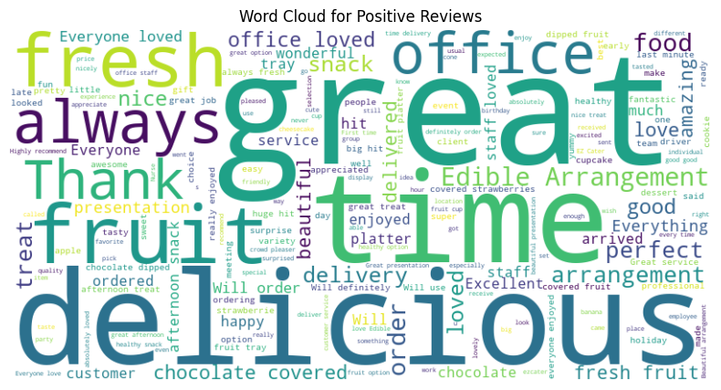
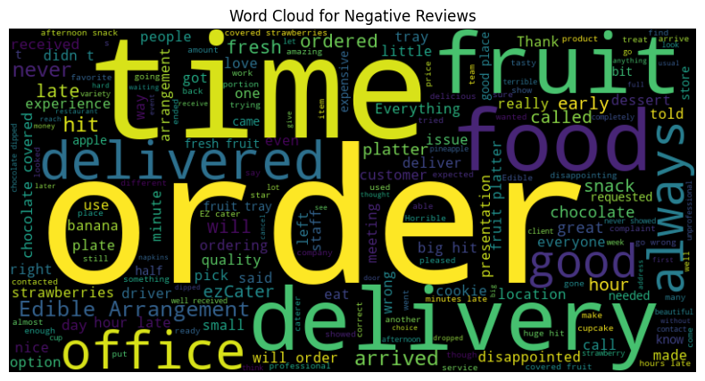

<h1 align="center">Edible Arrangements - Sentiment Analysis</h1>
<h2>Client Outline</h2>

Edible Arrangements specializes in creating fresh fruit arrangements, fruit bouquets, and gourmet chocolate-dipped fruit, offering a unique and healthy alternative to traditional floral gifts. This project aims to uncover growth opportunities and strategic initiatives to enhance Edible Arrangements' competitive edge in the modern market. 

<h2>Project Outline</h2>

This project has 3 main objectives:

<ol>
  <li> Gather review data from Edible Arrangements' catering platforms and securely store it in a database.</li>
  <li> Perform sentiment analysis on customer comments to accurately categorize feedback.</li>
  <li> Analyze and translate the sentiment analysis results into actionable strategic initiatives.</li>
</ol>

<h2> Analysis Results & Visualization </h2>

 Distribution of Sentiment Class 

 Distribution of Components' Contribution to Overall Sentiment 

 Word Cloud of Most Frequently Mentioned Words in each Sentiment Class 

